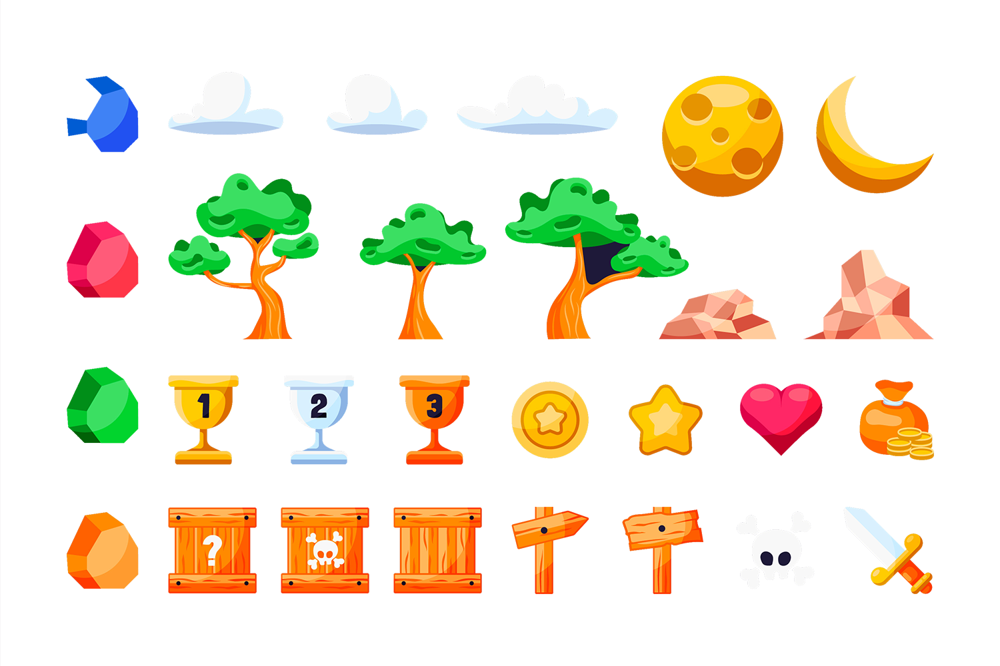
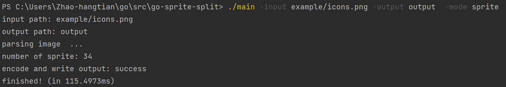
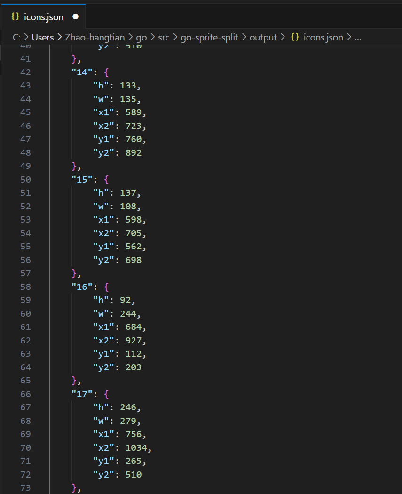
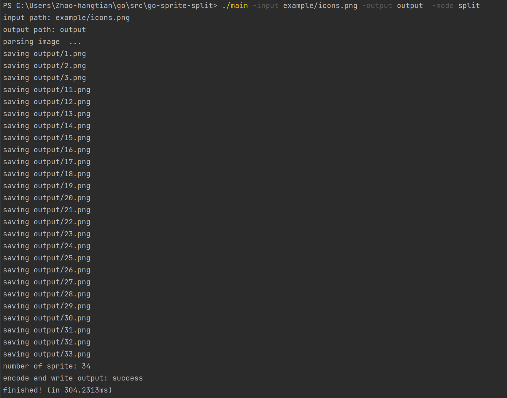
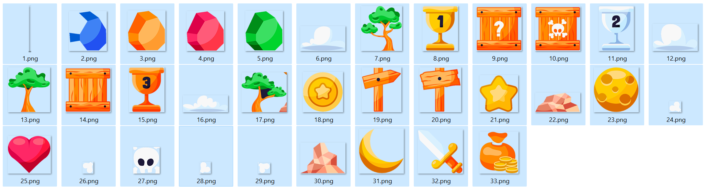

[中文版本](https://github.com/Zhao-hangtian/go-sprite-split#%E9%9B%AA%E7%A2%A7%E5%9B%BE%E5%88%87%E5%89%B2%E5%B7%A5%E5%85%B7) | [English Version](https://github.com/Zhao-hangtian/go-sprite-split#%23%20A%20utility%20for%20sprite%20info%20extract%20and%20split)

# A utility for sprite info extract and split
A simple PNG image material cutting tool implemented with Go, it performs the non-transparent continuous area cut on the Alpha (transparency channel) using the DFS (Depth-First Search) algorithm, and obtains the position information of the sprite sheet in the material package.

## Function
1. It achieves the extraction of the sprite sheet position area of the material package (to JSON format file), which can accurately locate the required materials. For why sprite sheets are needed, you can refer to here or here.

2. It achieves the cutting of the sprite sheet, that is, extracting all elements from a large material picture.

## Extension
1. If you have other desired output formats, feel free to modify this code~

2. If your materials are not PNG images with transparency channels, you can use tools such as GIMP, Photoshop to perform preliminary editing (add transparent layers, magic wand/color selection to remove background).

## Compilation
`go build main.go`

## Examples
Original material:

### 1. Extract Sprite Sheet Information
- Run
`./main -input example/icons.png -output output  -mode sprite`
- Output

You will get a split JSON file in the `output` directory, which contains the sprite sheet information:

The coordinates are based on the upper left corner as the zero point, `h` is height, `w` is width, `x1`, `y1` are the upper left coordinates, `x2`, `y2` are the lower right coordinates.

The formatted material location JSON information can be conveniently used in your game and app development process.

### 2. Split Large Images
- Run
`./main --input example/icons.png`
- Output

You will get the split small pictures in the `output` directory

---
# 雪碧图切割工具
使用Go实现的一个简单的PNG图片素材切割工具，基于在Alpha（透明度通道）使用DFS（深度优先搜索）算法做非透明连续区域的切割，得到素材包的雪碧图位置信息。

## 作用
1. 实现素材包雪碧图位置区域的提取（到JSON格式文件），可以精准定位到所需素材。为什么需要雪碧图可以参考[这里](https://www.w3schools.com/css/css_image_sprites.asp#:~:text=An%20image%20sprite%20is%20a,server%20requests%20and%20save%20bandwidth.)或者[这里](https://m.imooc.com/wiki/csssprite-whysprite#:~:text=%E5%88%A9%E7%94%A8%E9%9B%AA%E7%A2%A7%E5%9B%BE%E8%83%BD%E5%A4%9F%E5%BE%88,%E7%9A%84%E5%A4%A7%E5%B0%8F%E8%BF%98%E8%A6%81%E5%B0%8F%E3%80%82)。

2. 实现雪碧图的分割，即从一个大素材图里提取所有的元素。

## 扩展
1. 如果您有其他希望的输出格式，可以自由的修改此代码~

2. 如果您的素材不是带透明通道的PNG图片，可以使用GIMP，Photoshop等工具先进行见到那的编辑（增加透明图层、魔棒/色彩选择去除底部背景）。

## 编译
`go build main.go`

## 例子
原始素材：

### 1. 提取雪碧图信息
- 运行
`./main -input example/icons.png -output output  -mode sprite`
- 输出

  您将在目录`output`下得到分割得到JSON文件，里面包含了雪碧图信息：

坐标以左上方为零点，h是高度，w是宽度，x1，y1是左上坐标，x2，y2是右下坐标。

格式化的素材位置JSON信息可以在您的游戏、应用开发过程中方便的使用。

### 2. 分割大图片
- 运行
`./main --input example/icons.png`
- 输出

您将在目录`output`下得到分割得到小图片

